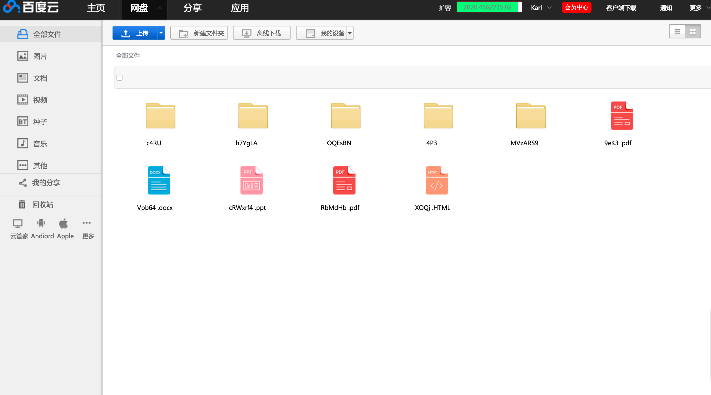
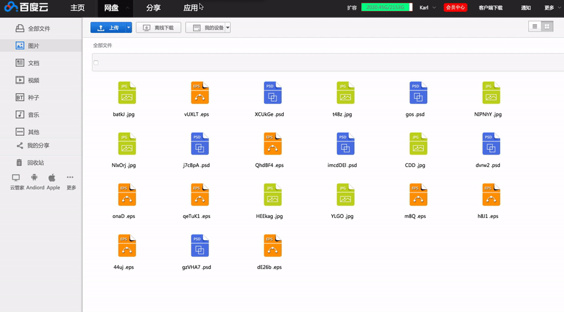

#仿百度云

断断续续 花了两周时间敲出来的百度云模仿
- 自己写的一个创建随机文件的函数RandomData 在打开网页的同时随机产生数据
- 然后用ECMA6的特性写了一个HTML模板,渲染数据到网页上
- 将各个数据分了类,并且添加了各自的监听事件事件
- 有两种布局模式 **列表** 和 **缩略图** 模式
- 三种排序 **文件名** 、**文件大小** 、 **修改日期**
- 有 **新建文件夹** 、 **修改文件名称** 、**模拟滚动条**、**画框选取** 等功能
-  回收站功能 现在还在处理bug
- 因为写这个项目,自己封装了一个处理Json数据的函数库,准备封装一个Jq插件

---

####我是想从事**前端开发**的的土木工程师,现准备在北京求一份实习(16毕业生),或者正式工作。要看我简历猛击这里
[邬一平的简历](http://resumeclear.applinzi.com/)